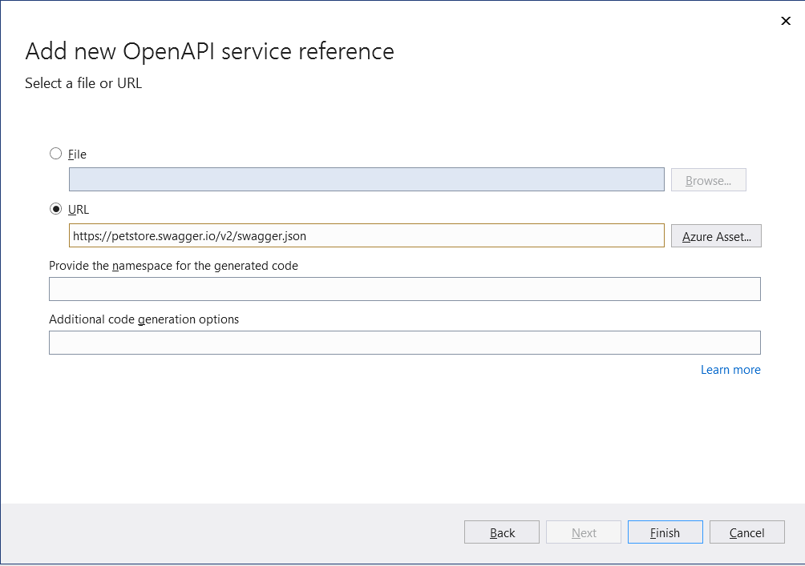
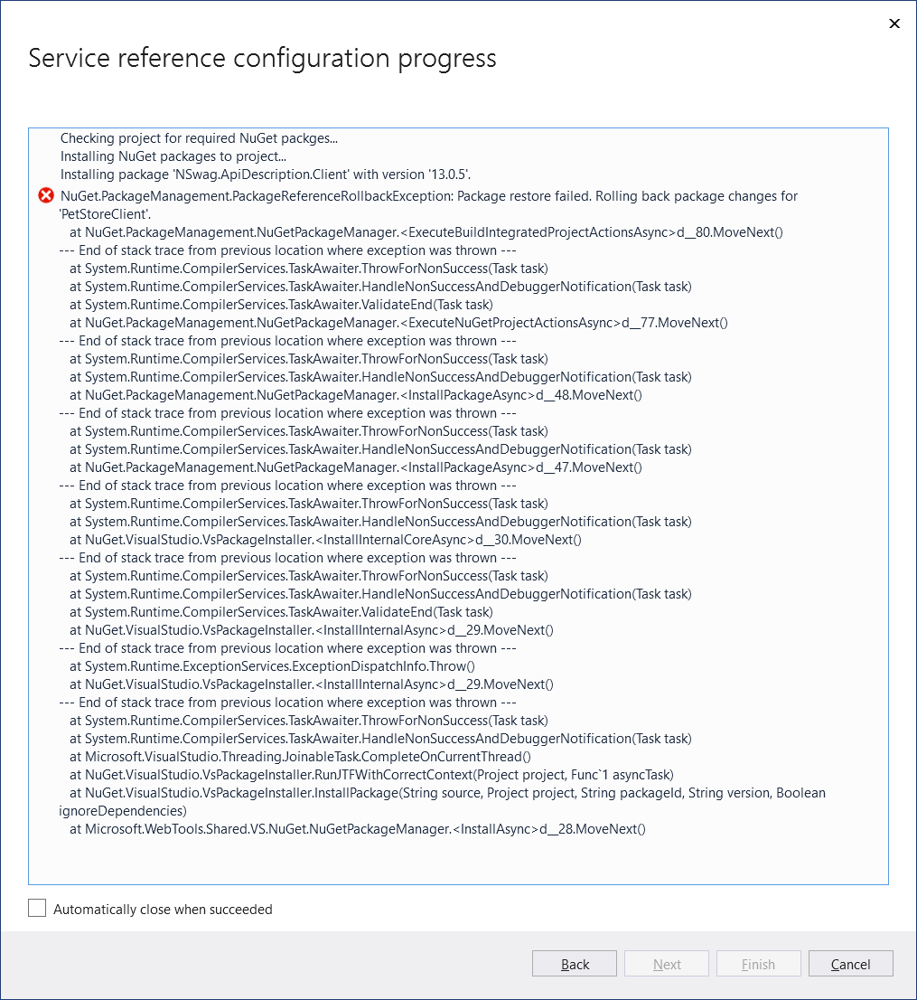

# connected-services-dep Repo

This repo contains example of dependency props file breaking the connected services wizard in VS2019.

### Step 1

Use the Add Connected Service menu item and point to the PetStore swagger file from https://petstore.swagger.io/v2/swagger.json

click Finish button to move to next step.

### Step 2

### Workaround I have found so far ...

1. Go to a directory/drive outside the solution to create the project
2. Run the wizard
3. Copy the changes to the csproj file back to orginal project in solution
4. Update the directory.packages.props file to include the <Package**Version**>
5. Update the csproj to remove the version info (as this is found in the props file)

I think the thing that may be causing the break is `<ManagePackageVersionsCentrally>true</ManagePackageVersionsCentrally>`